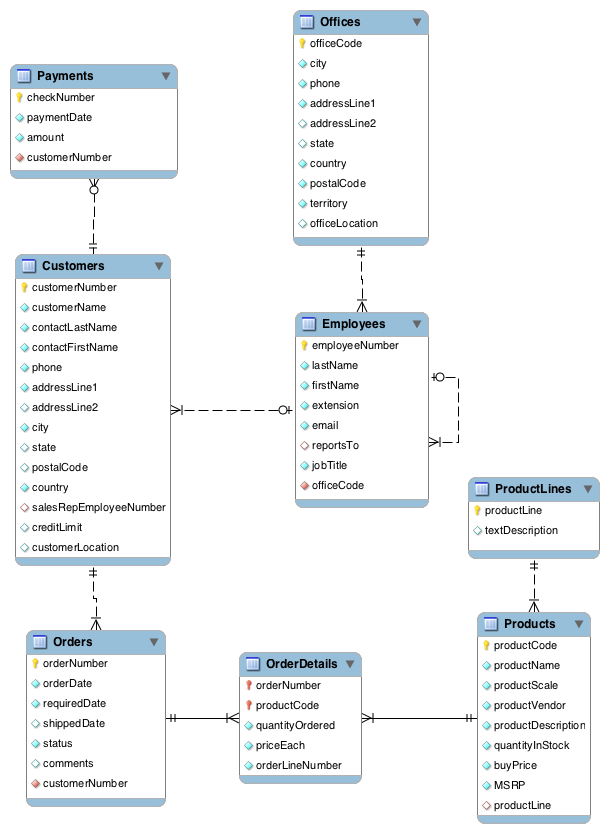

# Relational Databases and SQL (Structured Query Language)

A database is an organized collection of structured information, typically stored in the form of tables (rows & columns). Relational databases allow storing and retrieving different kinds of related information e.g. products, customers, and orders for an online shopping site. Structured Query Language or SQL (pronounced "sequel") is the most widely used language for interacting with relational databases, and is an essential skill for Data Science professionals.

The following topics are covered in this learning tutorial:

* Use cases and design of relational databases and SQL
* Setting up a database locally using MySQL server
* Creating, modifying and deleting databases and database tables
* SQL Data types and constraints (primary key, foreign key)
* CRUD (Create, Read, Update and Delete) operations on tables
* Exporting and importing data from relational databases

## Problem Statement
We'll learn about relational database and SQL by working through the following [problem](https://www.mysqltutorial.org/mysql-sample-database.aspx)

    QUESTION: Classic Models Inc. is a manufacturer of small scale models of cars, motorcycles, planes, ships trains etc. Products manufactured by Classic Models are sold in toy & gift stores around the world. Here's a small sample of their [products](https://www.tinytown.in/)
    

    Classic Models has offices around the world with dozens of employees. The customers of Classic Models are typically toy/gift stores. Each customer has a designated sales representative (an employee of Classic Models) they interact with. Customers typically place orders requesting several products in different quantities and pay for multiple orders at once via cheques.
    
    Create a database to record and manage all of the above information. The database will also be used for day-to-day operations (adding customers, placing orders, recording payments, hiring employees etc.).

## Relational Databases
There are many ways of storing data on a computer (text files, JSON files, CSV files, spreadsheets etc.). A relational database is a data storage system with the following properties:
1. Data is stored in tables e.g., customers, products, offices, employees, etc..
2. Each table has a set of columns. Each column is used to store a specific type of data.
3. Data is stored as rows (also called records) within database tables.
4. Tables support CRUD operations on rows: Create, Read, Update and Delete
5. Table can be connected to other tables using relationship constraints (e.g. an employee works at a specific office).
6. Information can be retrieved from the database using the Structured Query Language (SQL)
7. Databases can be hosted locally (on your computer) or on the cloud, for distributed access.

Here's what a table in a relational database looks like:

## Entity Relationship Diagrams
While setting up a relational database, it's common to create an "Entity Relationship Diagram" (ERD) to describe all the tables within the database and the relations between them. ERDs can be created using drawing tools like [LucidChart](https://www.lucidchart.com/pages/how-to-draw-ERD). Here's the ERD for the Classic Models database:

## SQL (Structured Query Language)
Structured Query Language or SQL is a programming language for interacting with relational databases. Unlike general purpose programming languages like Python, Java, C++ etc., SQL has a very limited syntax.

### SQL Statements and Syntax
There are three types of SQL statements:

####  Data Definition Language(DDL):
The Data Definition Language contains commands that are less frequently used. DDL commands modify the actual structure of a database, rather than the database’s contents. example:
* Generate a Table,
* Modifying (adding, changing, deleting) in the table structure

#### Data Control Language(DCL):
The Data Control Language allows you to manipulate and manage user access rights on database objects. It consists of two commands:
* GRANT: to grant access rights to database objects to users
* REVOKE: to remove access rights from users

#### Data Manipulation Language(DML):
Data Manipulation Language contains the subset of SQL commands used most frequently. It is used for searching, inserting, updating, and deleting data that we will see in this notebook.

Some quick notes on the SQL syntax:
* SQL is case insensitive. You can type statements in upper case, lowercase or a mixture of both
* Database names can be typed with or without backquotes i.e. classicmodels or `classicmodels`
* SQL statement can span over multiple lines and must end with a semicolon `;`
* The statements in this tutorial can be executed on the MySQL command line or the workbench
The SQL syntax for each relational database software package is slightly different. Check the official documentation of your DB for details.

## Setting up MySQL Server
Installations of MySQL server and MySQL workbench are installed from [here](https://dev.mysql.com/downloads/installer/) for Windows.

## Working with Databases and Tables

### Listing a Database
The first step in setting up a database is to create a database. A database can be created using the `CREATE DATABASE` statement. I used [this](https://drive.google.com/file/d/1QFVRlpQ0i6NNMLNQFfz4RDg6wWaV3h09/view) SQL File to create the database.

To display available databases, use the statement:

SHOW DATABASES;
Output:

+--------------------+
| Database           |
+--------------------+
| information_schema |
| mysql              |
| performance_schema |
| sys                |
+--------------------+
4 rows in set (0.01 sec)

### Creating a Database
Databases can be created using the CREATE DATABASE statement.

CREATE DATABASE `classicmodels`;
Once created, the database should appear in the list of databases

SHOW DATABASES;
Output:

+--------------------+
| Database           |
+--------------------+
| classicmodels      |
| information_schema |
| mysql              |
| performance_schema |
| sys                |
+--------------------+
5 rows in set (0.00 sec)
We can also conditionally create a database if it doesn't already exist using:

CREATE DATABASE IF NOT EXISTS `classicmodels`;

### Selecting a Database
A database must be selected before it can be used. This is done with the USE statement.

USE `classicmodels`;
All future statements like listing tables, creating tables, inserting or querying data will use the selected database.

### Deleting a Database
To delete a database, use DROP DATABASE

DROP DATABASE `classicmodels`;
The database will no longer show up in the list of databases.

SHOW DATABASES;
Output:

+--------------------+
| Database           |
+--------------------+
| information_schema |
| mysql              |
| performance_schema |
| sys                |
+--------------------+
4 rows in set (0.01 sec)

## Working with Tables
Making the tables for the Classic Models database according to the given Entity Relationship Diagram. We will also insert some data along the way.

* Tables in a database can be listed using the SHOW TABLES statement
* Tables are created using the CREATE TABLE statement
* Tables are deleted using the DROP TABLE statement
* One can view the structure of a table using the DESCRIBE statement
* Data can be inserted into a table using the INSERT INTO statement
While creating tables, we specify a list of columns and the data type for each column.

CREATE TABLE table_name (
    column1 datatype,
    column2 datatype,
    column3 datatype,
   ....
);

## SQL Challenges
1. Prepare a list of offices sorted by country, state, city.

2. How many employees are there in the company?

3. What is the total of payments received?

4. List the product lines that contain 'Cars'.

5. Report total payments for October 28, 2004.

6. Report those payments greater than \$100,000.

7. List the products in each product line.

8. How many products in each product line?

9. What is the minimum payment received?

10. List all payments greater than twice the average payment.

11. What is the average percentage markup of the MSRP on buyPrice?

12. How many distinct products does ClassicModels sell?

13. Report the name and city of customers who don't have sales representatives?

14. What are the names of executives with VP or Manager in their title? Use the CONCAT function to combine the employee's first name and last name into a single field for reporting.

15. Which orders have a value greater than $5,000?

